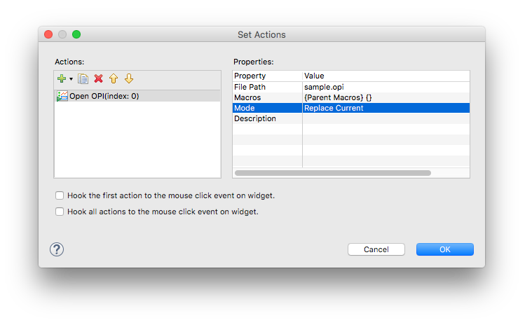

Actions
=======

Widgets have an **Actions** property which is used to trigger actions upon user interaction. The common case is to associate Actions with :doc:`control-widgets`, but in principle it can be made to work with other widgets as well.

The list of available actions currently includes:

Open OPI
    | Often used in combination with :doc:`Action Buttons <control-widgets>` to organize displays hierarchically.
    | Indicate the workspace path to the OPI with ``File Path``.
    | Use the ``Mode`` to select whether the OPI should by default open in the same tab. Note that the runtime user can override this default behaviour by right-clicking the button.

Write PV
    Writes the specified value to a PV. The variable ``$(pv_name)`` is automatically substituted with the PV attached to the widget.

Execute Command
    This executes a command on your operating system. It does not execute a telecommand. To execute a telecommand, select "Execute JavaScript" or "Execute Python Script". See :doc:`this example <example-action-telecommand>`.

Execute JavaScript
    Execute a JavaScript. Link to a script file in your workspace, or alternatively embed it into the Action

Execute Python Script
    Execute some Python script. Link to a script file in your workspace, or alternatively embed it into the Action

Play WAV File
    Plays the specified sound file

Open File
    Opens a workspace file with the default handler

Open Webpage
    Open the specified web page with the integrated web browser
