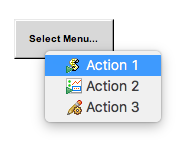
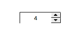
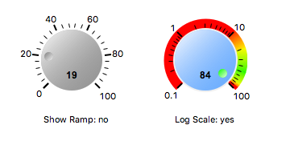
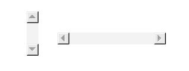
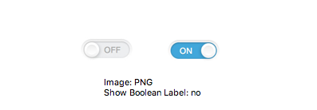
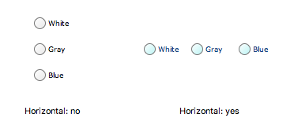
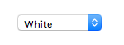

Control Widgets
===============

.. _action-button:

Action Button
-------------

A button that can be used to trigger :doc:`actions`. Use the **Toggle** property to have the option of adding a different action on press and release.

.. image:: _images/action-button.png
    :alt: Action Button
    :align: center

.. _menu-button:

Menu Button
-----------

A button that will show a menu when it's clicked. The menu will be filled with either the actions from **Actions** property or the string values from the connected enumerated PV.

.. _text-input:

Text Input
----------

A widget that allows the user to write data to the connected (writable) PV. For dates set the **Selector Type** to ``Datetime``.

.. image:: _images/text-input.png
    :alt: Text Input
    :align: center

.. _spinner:

Spinner
-------

The Spinner widget is similar to the Text Input, but allows updating the PV in incremental steps using up and down arrow buttons.

.. _scaled-slider:

Scaled Slider
-------------

This widget allows adjusting the connected PV value using a configurable slider.

.. image:: _images/scaled-slider.png
    :alt: Scaled Slider
    :align: center

.. _knob:

Knob
----

Knobs allow adjusting the connected PV value by dragging the thumb around.

.. _scrollbar:

Scrollbar
---------

Scrollbar that allows adjusting the connected PV value by. Useful as a building block for advanced display customizations.

.. _thumb-wheel:

Thumb Wheel
-----------

A widget that allows adjusting the decimal value of a PV digit by digit.

.. image:: _images/thumb-wheel.png
    :alt: Thumb Wheel
    :align: center

.. _boolean-switch:

Boolean Switch
--------------

A Boolean Switch is able to write ``0`` or ``1`` to a single configurable bit of the connected PV or the whole PV if the **Bit** property is set to ``-1``.

If **Width** is greater than **Height**, the switch will render horizontally, otherwise vertically.

.. image:: _images/boolean-switch.png
    :alt: Boolean Switch
    :align: center

.. _boolean-button:

Boolean Button
--------------

A Boolean Button is able to write ``0`` or ``1`` to a single configurable bit of the connected PV or the whole PV if the **Bit** property is set to ``-1``.

.. image:: _images/boolean-button.png
    :alt: Boolean Button
    :align: center

.. _image-boolean-button:

Image Boolean Button
--------------------

Same as the Boolean Button widget, but you can customize the look further by specifying your own images with the **Off Image** and **On Image** properties. The selected images must be present in the workspace.

.. _check-box:

Check Box
---------

A Check Box is able to write ``0`` or ``1`` to a single configurable bit of the connected PV or the whole PV if the **Bit** property is set to ``-1``. Use the **Label** property to render a value next to the check box.

.. image:: _images/check-box.png
    :alt: Check Box
    :align: center

.. _radio-box:

Radio Box
---------

A Radio Box allows the user to choose between a configurable set of values. Use the **Items** property to specify these values.

.. _choice-button:

Choice Button
-------------

Similar to the Radio Box, but with buttons. Toggling a button within the widget, untoggles the previously active button.

.. image:: _images/choice-button.png
    :alt: Choice Button
    :align: center

.. _combo:

Combo
-----
The Combo widget, as well, makes the user choose between one of its **Items**.

