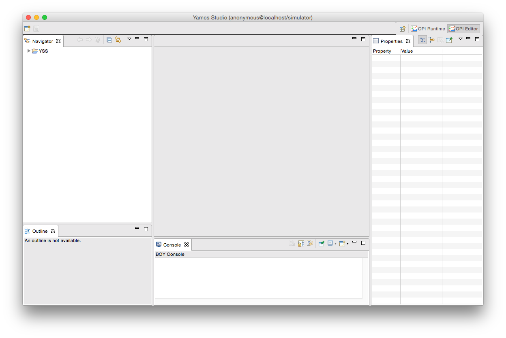

Display Builder
===============

The Display Builder window is used to create or edit displays.

In the left explorer, expand the YSS Landing project and open for example ``FlightData.opi`` by double-clicking the file.

The window layout can be decomposed like this:

.. image:: _images/yss-opi-editor-flight-data-annotated.png
    :alt: Edit FlightData.opi
    :align: center

1. Explorer
    The :doc:`explorer` contains all projects within the current workspace. In general a project is at the same level as a mission, but this is not strictly necessary. When we launch Yamcs Studio with a new workspace, it will always automatically create the YSS project. Once you have added your own project, you can remove YSS Landing and it will not be auto created anymore.

    A project contains Operator Displays (``*.opi``), images, style definitions (``*.def``), custom scripts (``*.js``), etc. By right-clicking an OPI file, displays can be opened in two different modes.

    * In editing mode (default)
    * In runtime mode (via a new view)

2. Editor Area
    The :doc:`editor-area` contains tabs for every OPI that was opened for editing. This offers familiar editing controls. Widgets can be selected, grouped, dragged and deleted to your personal taste.

3. Outline
    The :doc:`outline` view presents a hierarchical breakdown of all the widgets within the currently active editor tab. It is useful for finding back widgets. Widgets that were named will be easily identifiable.

4. Toolbar
    The toolbar offers context-sensitive controls. This includes general *Save* functionality, as well as handy features like grid toggling or space distribution among different widgets.

5. Properties
    The :doc:`properties` view shows the properties of widgets (or of the display itself). Notable properties include the **PV Name** which allows you to connect a widget with a specific Yamcs parameter (with autocompletion support). Other properties allow the display author to greatly tweak default widget behaviour. And in cases where the properties are not sufficient, we can always escape to more customization options using rules and scripts (there are properties for adding these as well).

6. Palette
    The :doc:`palette` contains the widgets that are available in your copy of Yamcs Studio. Select a widget from the Palette, and then click somewhere in the editor area to place it down.

When you are done doing changes, make sure to save them (**File > Save All**). You can now test out your changes by clicking the launch button |opi-editor-launch| from the toolbar.

This will open a new runtime window (notice it uses the OPI Runtime perspective). If you leave this window open, and you save more changes, do a right-click in your display tab and choose **Refresh OPI**. You will do this a lot as you go about editing displays. You can also refresh by hitting **F5**, but make sure that your display actually has focus (for example by clicking somewhere in the editor before hitting **F5**).

.. |opi-editor-launch| image:: _images/opi-editor-launch.png
