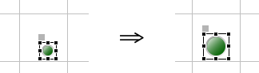
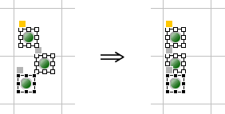

Editor Area
===========

The Editor Area is a unique zone in Yamcs Studio where files are opened for editing. Typically this would be a display file (``*.opi``), but it doesn't have to be.

OPI Files
---------

OPI stands for Operator Interface, but is more commonly referred to as a *display*. OPIs are often static, but when needed can be made very dynamic by combining different widgets and PVs together using concepts like :doc:`actions`, :doc:`rules` and :doc:`scripts`.

In the Display Builder window, create a new OPI file, right-click in the Explorer on the desired location, and select **New > OPI File**.

.. image:: _images/sample-opi.png
    :alt: Sample OPI
    :align: center

OPI files are created with some default properties, which includes a grid, and a size of 800x600. We will see in the section on :doc:`properties` that we can edit these properties.

Palette
-------

Notice the :doc:`palette` attached to the right of the Editor Area. The Palette contains the widgets bundled with your version of Yamcs Studio. Use the palette as your toolbox when you author a display.

To add a widget to your display, click first on its icon in the Palette, then click where you want to put it in the Editor Area.

We select as example an LED.

.. image:: _images/an-led.png
    :alt: An LED
    :align: center

Once the widget has been placed, you can finetune its position and size using the :doc:`properties` view. Some operations are also readily available in the Editor Area itself using familiar controls. For example, to enlarge a widget, select it, then drag its handles around with the mouse.

You can also move a widget by pressing it, while dragging it to another location.

To select multiple widgets, drag a box around them. To add widgets to an existing selection, hold the ``Ctrl`` key (Cmd on Mac) while selecting the widgets one by one. Remove a widget from the selection in similar fashion.

Positioning Widgets
-------------------

The toolbar of Yamcs Studio contains tools that help us align multiple selected widgets. For example, clicking **Align Left** repositions these three LEDs to the leftmost position.

There are similar tools for vertical alignments, as well as for distributing horizontal or vertical space between selected widgets.

Match Size
----------

We can also standardize the size of selected widgets. For example. By clicking **Match Width** and **Match Height** in sequence, we made these three LEDs the same size.

.. image:: _images/match-size.png
    :alt: Match Size
    :align: center

The size of the last selected widget is taken as the reference. This reference widget is highlighted with black instead of white anchor points.

.. note::
    In this particular case of non-square LEDs, clicking only **Match Width** would actually have been sufficient since round LEDs can't take on the shape of an ellipse.
