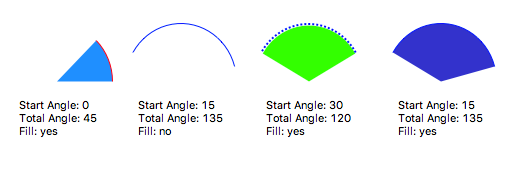
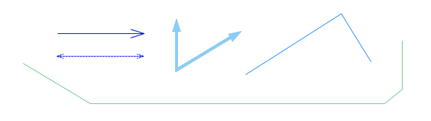
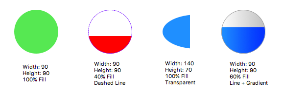
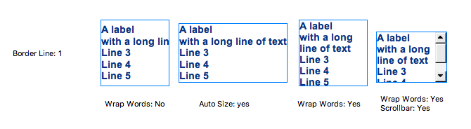
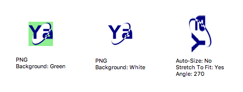

Graphic Widgets
===============

.. _arc:

Arc
---

Draws an arc contained by the bounding box. To modify the size of the arc, modify the **X**, **Y**, **Width** and **Height** properties.

By default the arc starts with an angle of 0 degrees (right center). Modify this property using **Start Angle** (in degrees). The arc length is determined using **Total Angle**.

.. _polyline:

Polyline
--------

Use the polyline tool to draw lines of two or more points. After selecting the widget from the Palette, start by clicking on your desired start location. Every next click will add a new point. Double-click if this is your last point. You can modify your points by moving around the yellow handles. Finetune your points using the **Points** properties.

Polylines have a direction and can be decorated with arrow heads using the various **Arrow** properties.

.. _polygon:

Polygon
-------

Similar in functionality to polylines, but the last point is always connected to the first point to form a closed shape. Unlike polylines, polygons are not directed. The can be filled from left to right or from bottom to top using the **Fill Level**, and **Horizontal Fill** properties. In the section :doc:`rules` we'll see that this (or just about any other property) can also be dynamically modified.

.. image:: _images/polygon.png
    :alt: Polygon
    :align: center

.. _rectangle:

Rectangle
---------

Rectangles are constrained polygons. They can be customized in much the same way as polygons. Unlike polygons the background and foreground can also be colored using gradients which makes them look less flat.

.. image:: _images/rectangle.png
    :alt: Rectangle
    :align: center

.. _rounded-rectangle:

Rounded Rectangle
-----------------

Rounded rectangles are a specialised form of Rectangles. They support additional properties for controlling **Corner Height** and **Corner Width**.

.. image:: _images/rounded-rectangle.png
    :alt: Rounded Rectangle
    :align: center

.. _ellipse:

Ellipse
-------

The Ellipse's shape is determined by its bounding box using the **Width** and **Height** properties. Ellipses support similar properties as rectangles.

.. _label:

Label
-----

The Label widget allows displaying text within a bounding box indicated by the **X**, **Y**, **Width** and **Height** properties. Adapt your bounding box to the content using **Auto Size** property.

For long texts consider using the **Wrap Words** and **Show Scrollbar** properties.

To edit the text of a label, either select the **Label** property to open an input dialog, or press **F2** to edit the label in-place.

.. _image:

Image
-----

Yamcs Studio supports GIF, JPG, PNG and BMP images. Images must be added to your project before you can select them with the **Image File** property. Transparency is automatically supported as well, but make sure to set the background of the Image widget to the same color as the container.

