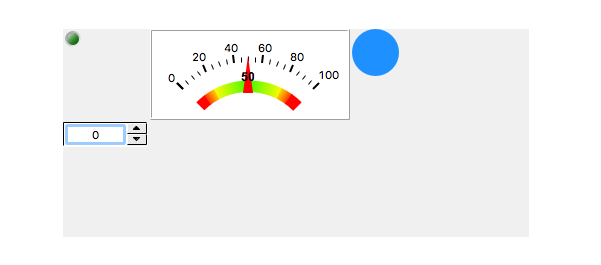
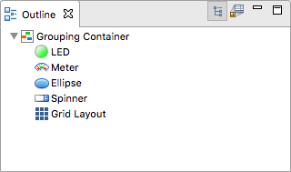

Grid Layout
===========

This is a special type of widget that is meant to be attached to a container or to the display itself. At runtime it reorganizes the children of that container in a grid. This usually works best with similarly sized widgets.

Create a Grid Layout by selecting it from the Palette, and clicking on top of the targeted container. You'll notice a grid decoration element in the top left of the container.

For example, while editing it may look like this:

.. image:: _images/grid-layout-edit.png
    :alt: Edit Grid Layout
    :align: center

But at runtime, with 3 columns, it renders like this:

The order of the container's children is important for this layout, and can be modified in the :doc:`../outline` view.

