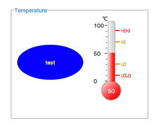

Grouping Container
==================

You can group widgets together using a Grouping Container. Drag any widget on top of it to make it part of the group. Being widgets themselves, grouping containers can have their own backgrounds and borders.

To remove a widget out of a group, select it and drag it out of its container. To remove a group, right-click on it and select **Ungroup**. To add existing widgets to a new group, select them, and then choose **Group** from the right-click menu.

To prevent nested widgets from being individually selectable, set the **Lock Children** property of the group to ``yes``.

