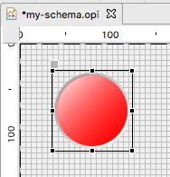
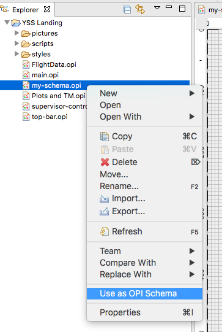
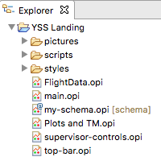

OPI Schema
==========

The default property values of any widget can be overriden via an **OPI Schema**. A schema is an OPI file like any other, but which contains a set of widgets whose properties are used as defaults.

This is best illustrated with an example. Let's say we want to modify the defaults of the LED widget. Create a new OPI file and add a LED to the canvas (anywhere).

.. image:: _images/schema-green-led.png
    :alt: Default LED
    :align: center

Make the LED bigger and change the colors.

Save your changes. Then right-click your file and select **Use as OPI Schema**.

Notice your schema file now shows a small decorator in the `<explorer>`_ view:

Whenever you add a new LED to any display, it will now by red and big by default. The same principle can be applied to any other properties of any of the available widgets.

A schema may contain multiple widgets, however if there are multiple widgets of the same type, only the first occurrence is considered. This is the widget that appears the highest in the `<outline>`_ view.

Only one OPI Schema can be active at a time. To unset the active schema, Right-click it in the `<explorer>`_ view and untick **Use as OPI Schema**. This will return Display Builder to its default behaviour.
