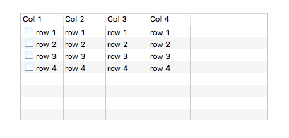
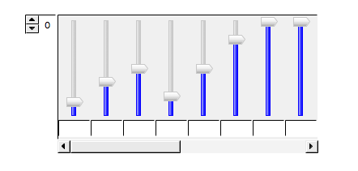
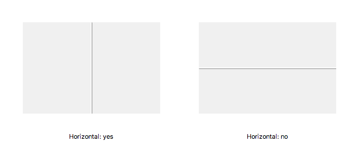
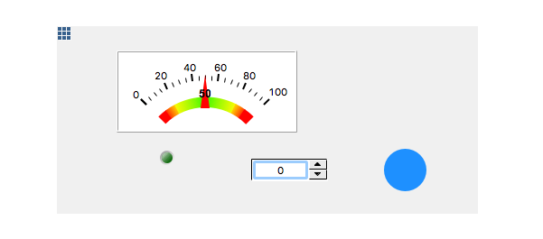

Other Widgets
=============

.. _table:

Table
-----

Advanced widget for structuring tabular data. Does not connect to PVs by itself. Its main use comes when combined with scripts.

.. _web-browser:

Web Browser
-----------

The Web Browser widget allows incorporating a web browser inside a display. This may be useful in managed environments, but in general we would recommend using a standalone web browser. The option is there though. Choose the start page with the **URL** property.

.. image:: _images/web-browser.png
    :alt: Web Browser
    :align: center

.. _array:

Array
-----

Container widget that repeats another widget. First create an Array instance, than drag another widget on top of it and release. The widget will be repeated for the defined **Array Length**.

Modifying the property of any child modifies it for all the other children as well.

The Array widget must be connected to a an array PV.

.. _grouping-container:

Grouping Container
------------------

You can group widgets together using a Grouping Container. Drag any widget on top of it to make it part of the group. Being widgets themselves, grouping containers can have their own backgrounds and borders.

To remove a widget out of a group, select it and drag it out of its container. To remove a group, right-click on it and select **Ungroup**. To add existing widgets to a new group, select them, and then choose **Group** from the right-click menu.

To prevent nested widgets from being individually selectable, set the **Lock Children** property of the group to ``yes``.

.. image:: _images/grouping-container.png
    :alt: Grouping Container
    :align: center

.. _linking-container:

Linking Container
-----------------

Displays can include other displays, or groups of other displays. This is particularly useful to avoid duplication when creating shared components, such as top bars or side bars.

Define the included OPI file with the **OPI File** property, then optionally define the group with the **Group Name** property. If you don't specify a group the entire display is embedded. Tweak properties such as the **Resize Behaviour** to get your desired outcome.

.. _tabbed-container:

Tabbed Container
----------------

Creates a stack of tabs. Define the number of tabs with the **Tab Count** property.

.. image:: _images/tabbed-container.png
    :alt: Tabbed Container
    :align: center

.. _sash-container:

Sash Container
--------------

Use the Sash Container to create resizable split panes.

.. _grid-layout:

Grid Layout
-----------

This is a special type of widget that is meant to be attached to a container or to the display itself. At runtime it reorganizes the children of that container in a grid. This usually works best with similarly sized widgets.

Create a Grid Layout by selecting it from the Palette, and clicking on top of the targeted container. You'll notice a grid decoration element in the top left of the container.

For example, while editing it may look like this:

But at runtime, with 3 columns, it renders like this:

.. image:: _images/grid-layout-run.png
    :alt: Run Grid Layout
    :align: center

The order of the container's children is important for this layout, and can be modified in the `<outline>`_ view.

.. image:: _images/grid-layout-outline.png
    :alt: Grid Layout Outline
    :align: center
