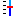
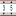
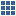

Palette
=======

The Palette is a fold-out zone of the :doc:`editor-area` that contains the widgets bundled with your version of Yamcs Studio, which may contain less or more widgets than the default widgets documented below.

Widgets come in all different kinds, and are grouped in four different categories.

.. toctree::
    :hidden:

    graphic-widgets
    monitor-widgets
    control-widgets
    misc/index

Graphics
--------

.. list-table::
    :widths: 33 33 33

    * - |arc| :ref:`arc`
      - |rectangle| :ref:`rectangle`
      - |label| :ref:`label`
    * - |polyline| :ref:`polyline`
      - |rounded-rectangle| :ref:`rounded-rectangle`
      - |image| :ref:`image`
    * - |polygon| :ref:`polygon`
      - |ellipse| :ref:`ellipse`
      -

.. |arc| image:: ../widgets/_images/arc.png
.. |ellipse| image:: ../widgets/_images/ellipse2.png
.. |image| image:: ../widgets/_images/image.png
.. |label| image:: ../widgets/_images/label.png
.. |polygon| image:: ../widgets/_images/polygon.png

.. |rectangle| image:: ../widgets/_images/rectangle2.png
.. |rounded-rectangle| image:: ../widgets/_images/roundedRectangle.png

Monitors
--------

.. list-table::
    :widths: 33 33 33

    * - |led| :ref:`led`
      - |progress-bar| :ref:`progress-bar`
      - |xygraph| :ref:`xygraph`
    * - |image-boolean-indicator| :ref:`image-boolean-indicator`
      - |gauge| :ref:`gauge`
      - |intensity-graph| :ref:`intensity-graph`
    * - |text-update| :ref:`text-update`
      - |thermometer| :ref:`thermometer`
      - |byte-monitor| :ref:`byte-monitor`
    * - |meter| :ref:`meter`
      - |tank| :ref:`tank`
      -

.. |byte-monitor| image:: ../widgets/_images/ByteMonitor.png
.. |gauge| image:: ../widgets/_images/gauge2.png

.. |intensity-graph| image:: ../widgets/_images/intensityGraph.png
.. |led| image:: ../widgets/_images/LED.png
.. |meter| image:: ../widgets/_images/XMeter.png
.. |progress-bar| image:: ../widgets/_images/ProgressBar.png

.. |text-update| image:: ../widgets/_images/textUpdate.png
.. |thermometer| image:: ../widgets/_images/Thermo.png
.. |xygraph| image:: ../widgets/_images/XYGraph.png

Controls
--------

.. list-table::
    :widths: 33 33 33

    * - |action-button| :ref:`action-button`
      - |knob| :ref:`knob`
      - |image-boolean-button| :ref:`image-boolean-button`
    * - |menu-button| :ref:`menu-button`
      - |scrollbar| :ref:`scrollbar`
      - |check-box| :ref:`check-box`
    * - |text-input| :ref:`text-input`
      - |thumb-wheel| :ref:`thumb-wheel`
      - |radio-box| :ref:`radio-box`
    * - |spinner| :ref:`spinner`
      - |boolean-switch| :ref:`boolean-switch`
      - |choice-button| :ref:`choice-button`
    * - |scaled-slider| :ref:`scaled-slider`
      - |boolean-button| :ref:`boolean-button`
      - |combo| :ref:`combo`

.. |action-button| image:: ../widgets/_images/actionbutton.png
.. |boolean-button| image:: ../widgets/_images/BoolButton.png

.. |choice-button| image:: ../widgets/_images/ChoiceButton.png

.. |image-boolean-button| image:: ../widgets/_images/imageButton.png

.. |radio-box| image:: ../widgets/_images/radiobutton.png

.. |scrollbar| image:: ../widgets/_images/scrollbar.png

.. |text-input| image:: ../widgets/_images/textInput.png

Others
------

.. list-table::
    :widths: 33 33 33

    * - |table| :doc:`misc/table`
      - |grouping-container| :doc:`misc/grouping-container`
      - |sash-container| :doc:`misc/sash-container`
    * - |web-browser| :doc:`misc/web-browser`
      - |linking-container| :doc:`misc/linking-container`
      - |grid-layout| :doc:`misc/grid-layout`
    * - |array| :doc:`misc/array`
      - |tabbed-container| :doc:`misc/tabbed-container`
      -

.. |grouping-container| image:: ../widgets/_images/groupContainer.png
.. |linking-container| image:: ../widgets/_images/linkingcontainer.png
.. |sash-container| image:: ../widgets/_images/SashContainer.png
.. |tabbed-container| image:: ../widgets/_images/tab.png

.. |web-browser| image:: ../widgets/_images/web_browser.png
