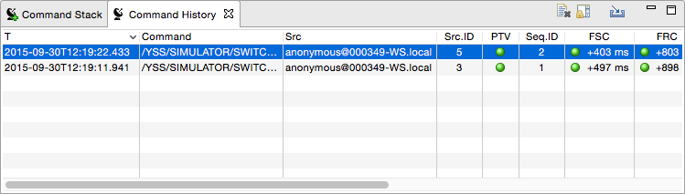

Command History View
====================

The Command History keeps track of all commands that were issued using Yamcs (not just by yourself, but by anyone).

It will by default only show commands that were received on the realtime processor since you started your copy of Yamcs Studio. To load the command history for an earlier time range, select |import_wiz| **Import**.

Clear your view by clicking |clear| **Clear**. You can always import the cleared commands again at a later time.

When Yamcs Studio becomes aware of a new command that was issued by Yamcs, it will automatically select and reveal it. You can prevent this default behaviour by toggling the |lock_co| **Scroll Lock**.

The displayed columns are as follows.

T
    Time when the command was issued

Command
    The command in textual format

Src
    The origin of the command. Typically in *user@host* format

Src.ID
    The ID that was given to the command by the issuing application. This number is assigned by the source application. In case of Yamcs Studio it is an incremental number that resets to 1 on every restart of Yamcs Studio.

PTV
    Result of the Pretransmission Verification as performed by Yamcs. For example, some commands may only be applicable for 10 seconds and needs certain other parameters to be set to specific values. When the PTV bubble colors red, these type of context-dependent checks could not be validated, and therefore the command was not actually issued.

Seq.ID
    The id that was determined by Yamcs before further dispatching the command. This is an incremental number that resets on every restart of Yamcs.

Further Columns
    | Indicate acknowledgments of ground hops as the command is being dispatched. The exact number and name of the columns depends largely on how Yamcs is deployed at your site. Yamcs typically calculates the state of these bubbles based on incoming telemetry.
    | The bubble becomes green |ok| or red |nok| depending on the verification result. The column value shows the time difference with the issuing time *T*.

.. |clear| image:: _images/clear.png
.. |import_wiz| image:: _images/import_wiz.png
.. |lock_co| image:: _images/lock_co.png
.. |nok| image:: _images/nok.png
.. |ok| image:: _images/ok.png
