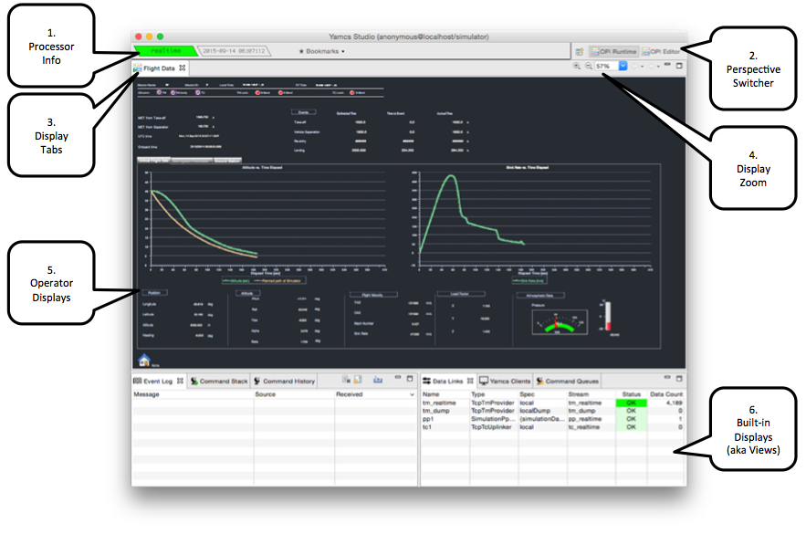

Display Runner
==============

The Display Runner window is useful for realtime operations, or for testing out displays as they are being built. The default layout looks like this:

1. Processor Info
    This zone holds two status indicators. The first indicator light shows the processor that Yamcs Studio is currently listening to. Yamcs supports many concurrent processors (realtime, replay channels). By default Yamcs Studio will always connect to ``realtime``.

    Next to that we see a second indicator which currently shows the processor time as provided by Yamcs. The simulator outputs generation times equal to the local system clock.

3. Display Tabs
    Displays open in different tabs. By clicking and dragging these tabs we can easily create split screens, or different tab stacks. We can also drag a tab out of its parent window into a new window. In fact, Yamcs Studio is optimised for multi-monitor systems. Window layouts are restored through restarts of Yamcs Studio.

4. Display Zoom
    The display shown in the picture was configured in such a way that it automatically stretches (while preserving aspect ratio) to fit the available screen space. This behaviour can be turned on or off by the display author. Regardless of its setting, as a display user we can always zoom in or out of the display using these controls.

5. Operator Displays
    This area contains displays that were authored in the Display Builder window. Displays contain any number of widgets. Most widgets can be connected to TM, which will also make them alarm-sensitive. In practice this means that they will be highlighted using different decorations depending on the alarm level. There are also things like button widgets which can for example open other displays, or launch a telecommand, or open dialog boxes, etc. All widgets are highly customisable using scripts and/or rules.

6. Built-In Displays
    Yamcs Studio comes with an array of built-in displays that offer more dynamic views on different aspects of Yamcs. These built-in displays (or :doc:`../views/index`, as Yamcs Studio calls them) cover concepts like commanding, event logging, alarm overview and archive browsing.
