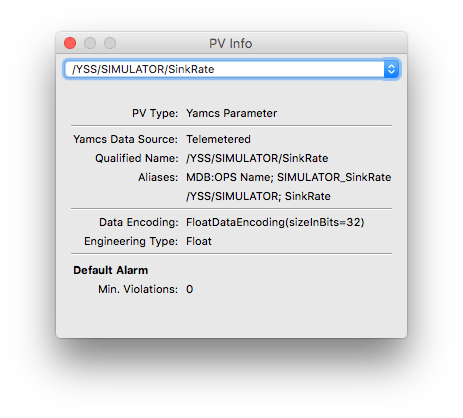

PV Info
=======

Right-click on a widget backed by a PV, and select **PV Info**. This opens a window where you get extra information on the PVs in that widget. If there are multiple PVs for that widget, select the PV of your interest using the top dropdown selector. For Yamcs parameters, you will see various properties that were defined in the Mission Database.

.. image:: _images/pvinfo-pv.png
    :alt: PV
    :align: center

