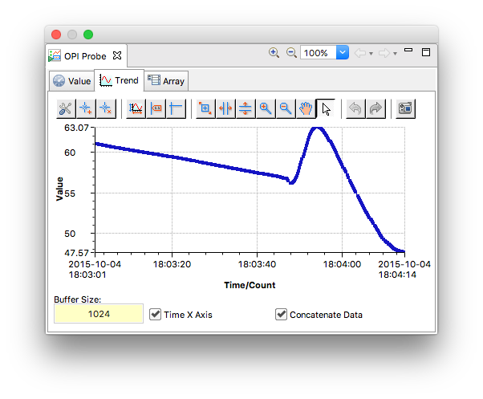

OPI Probe
=========

Right-click on a widget backed by a PV, and select **Process Variable > OPI Probe**. This opens the OPI Probe view with:

* In the **Value** tab, a meter indicating the validity range. This is however not fully implemented yet, and therefore often shows a very large range of values.
* In the tab **Trend**, a graphical evolution of this PVs value. There is currently no way to navigate to archived data.

