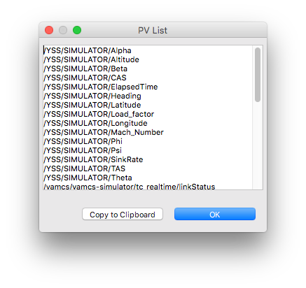

PV List
=======

Right-click anywhere in a display, and choose **Dump PV List**, you will see a window listing the unique PVs that are defined inside any widget of that display. This can be useful for quick-fixing runtime issues.

