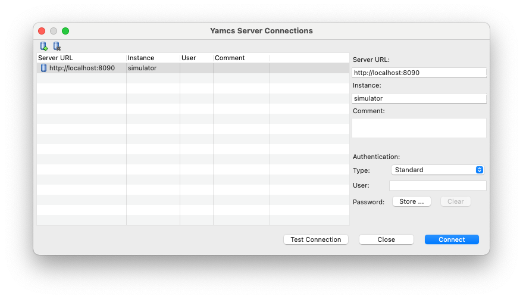

Connect to Yamcs
================

Yamcs Studio can connect as a client to Yamcs Server.

Yamcs Server, or 'Yamcs', handles the processing, archiving and dispatching of telemetry data. Yamcs Studio is one of the possible Yamcs clients for receiving telemetry data.

To configure a Yamcs connection, select **Yamcs > Connect...**. This will open the Connections window where you can manage your connections. For many missions, one connection will do just fine, but depending on how Yamcs is deployed at your site, you may have multiple Yamcs instances on the same server, or even multiple Yamcs servers.

Click |server_add| **Add Server** to add a server connection, or |server_remove| **Remove Server** to remove the selected server connection.

The right panel contains editable details for the selected server connection:

Server URL (required)
    Specify the base URL for reaching Yamcs. For example http://localhost:8090

Instance (required)
    Yamcs can run multiple instances in parallel. You can think of instances like different environments, where every instance is completely separated from the other instance. While Yamcs Server may be running multiple instances in parallel, Yamcs Studio will always connects the user to one specific instance, which you have to configure here.

User / Password (optional)
    If your Yamcs instance is secured, fill in your user and password here.

    Optionally, the password can be stored to your OS keychain. If you don't do so, you
    will be prompted each time you attempt to connect to Yamcs.

.. note::

    Connection preferences are stored in a hidden folder under your home directory, and will continue functioning whenever you upgrade your copy of Yamcs Studio.

.. |server_add| image:: _images/server_add.png

