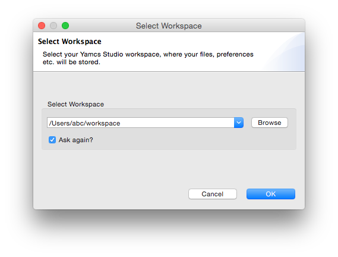

First Steps
===========

Launching Yamcs Studio
----------------------

When you launch Yamcs Studio for the first time it will ask you to choose a workspace. A **workspace** is where you store your resources (e.g. a display file).

With Yamcs Studio, you are always working on one workspace at a time. Usually workspaces are fairly static, and you can often do with just one of them.

Choose your preferred location, and click **OK**.

Empty Workspace
---------------

Yamcs Studio is now launched and you should see an empty workspace with the default window arrangement:

.. image:: _images/empty-workspace.png
    :alt: Empty Workspace
    :align: center

The empty area in the middle is where displays will open.

Yamcs Studio has two different windows. Display Builder and Display Runner. When Yamcs Studio is launched for the first time on a new workspace the user will be welcomed with the default Display Builder window.
