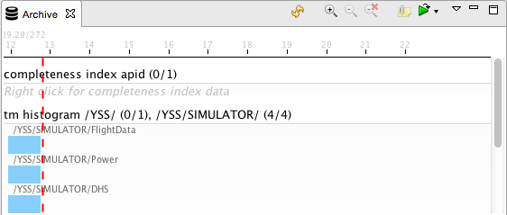
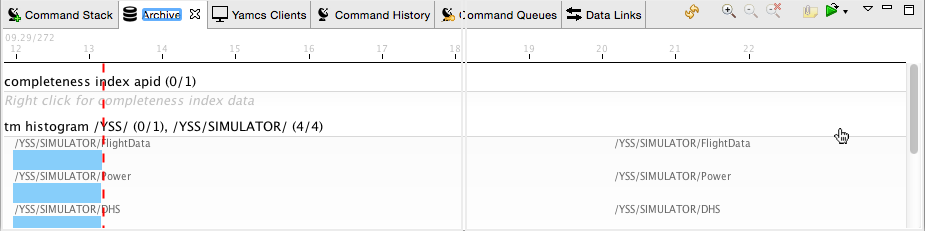
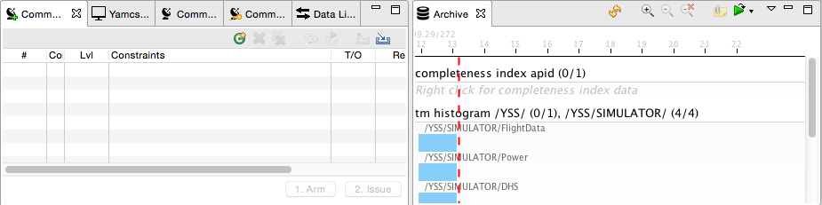
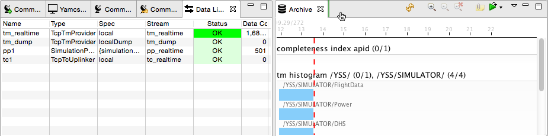
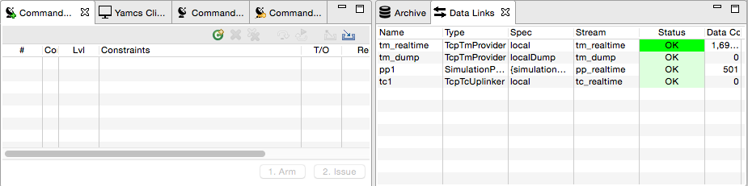

Understanding the User Interface
================================

Yamcs Studio is composed out of multiple views that are arranged together in windows. The user has great flexibility in modifying the default arrangement.

Views
-----

Views all share the same user interface organization. On the left you see a tab with the view icon, followed by a title, and then a close icon. On the outer right there are actions to |view-minimize| **Minimize** or |view-maximize| **Maximize** the view. Some views (such as the one in the screenshot) also have a third pull-down icon |view-pulldown| with view-specific actions in it. Most views, though, add dedicated colored icons next to the standard icons. The pull-down menu is used to hide less-often used actions.

.. note::

    To reopen a view which you closed earlier, or to open another view choose **Window > Show View**.

Views can be resized, moved and stacked. This allows you to customize your workspace to your own personal preference.

For example, let's say we want to put the Archive view in its own dedicated location. Click on the tab title, and while holding the mouse down, drag towards the right. If you move far enough, you will notice an outline suggesting the view's new position (this may look slightly different on your platform).

Release the mouse to confirm this view's new position.

Let's say we want to move the Data Links view to the right as well. Again, click its title and drag your mouse next to the Archive tab. You will see a green bar suggesting this tab's new placement.

Release the mouse to confirm this view's new position.

As you try dragging to different locations, you will notice that Yamcs Studio has several hot spots where you can attach your views. For example, you can detach windows by dragging them outside of your application window. This provides additional screen space if your workstation supports multiple monitors.

When you close Yamcs Studio and later reopen it, your last view and window arrangement will be restored.

.. note::

    Yamcs Studio stores the information about your view arrangement in a ``.metadata`` folder inside your workspace. This is how it knows how to restore this information through restarts. If you share your workspace with other users through a version control system, you should consider *not* committing this ``.metadata`` folder. This way everybody can have his own preferred arrangement without colliding with each other.

Windows
-------

Yamcs Studio uses two special windows that serve a different purpose:

* Display Builder
* Display Runner

On a new workspace, Yamcs Studio will by default open the Display Builder window. The Display Builder includes a default set of views that allow creating or editing operator displays.

In the top toolbar, you can see a play button which allows you to open the Display Runner window. This window includes a different set of windows that put the focus on operations. In this window, displays open in runtime mode.

In the top toolbar of the Display Runner there is a pickaxe button which allows you to open or bring to the front the Display Builder window.

If at any time you want to reset your window to the defaults, select **Window > Reset Window Layout...**.

.. |view-pulldown| image:: _images/view-pulldown.png
