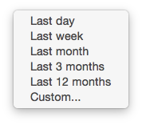
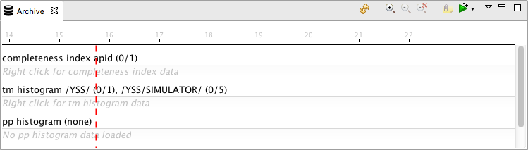
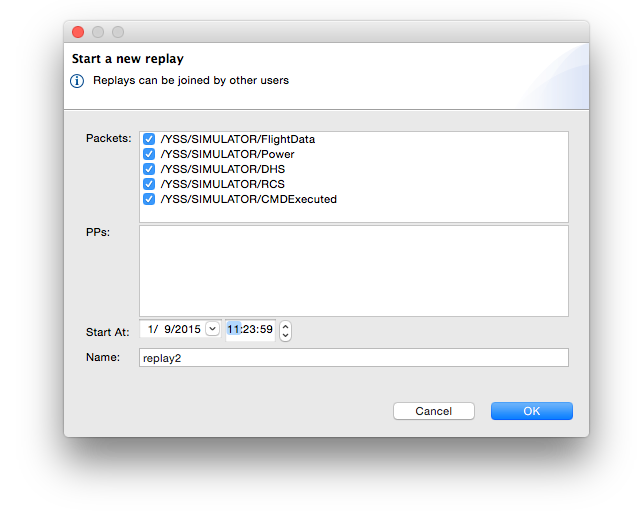
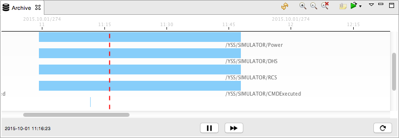

Archive
=======

The Archive view represents a visual view of the data stored in the Yamcs archive. Through this view we can also initialize and control replays of archived telemetry.

User Interface
--------------

The Archive view always works on a range of indexed data, which it fetches from the server. All further actions like zooming happen client-side on the loaded data range.

Choosing a Data Range
^^^^^^^^^^^^^^^^^^^^^

As a first step you should select your data range. Click the pull-down icon |view-pulldown| to bring up this menu:

You can choose one of the predefined half-open time intervals, or you can select **Custom...** to specify your preferred range. Ranges can be half-open, which means they will always grow to include more bordering data as it becomes available.

If you choose for example **Last Day**, Yamcs Studio will fetch an index of the archive for that time period, and refresh your view.

Your chosen data range is stored in your user preferences and will be restored the next time you open Yamcs Studio.

Selecting Data
^^^^^^^^^^^^^^

If this is the first time you have opened Yamcs Studio on your workstation, you won't see anything other than some empty zones named:

* Completeness Index APID
* TM Histogram
* PP Histogram
* CMDHIST Histogram

You need to choose which index data you actually want to display in your view. If there is data available for a zone, you can right-click it to bring up a pop-up menu where you select **Add Packets > ... > All Packets**. Your view will then update to show the selected packets.

.. note::

  We say *packets* since this is typically what we are interested in when browsing the Archive, but any recorded data can in reality be displayed through the Archive view.

.. image:: _images/archive.png
    :alt: Archive
    :align: center

Note that the view does not refresh itself, so hit |refresh| **Refresh** whenever you want to load the latest data for your selected time range.

Navigating
^^^^^^^^^^

The vertical red locator shows the current time as provided by Yamcs. When we hover the mouse over the view, a greyed-out locator indicates the current mouse position.

It is also possible to **Zoom In** |zoom_in| or **Zoom Out** |zoom_out|. If you are interested in a specific range, select a time range by clicking and dragging your mouse over the range before you zoom in using the zoom in button.

Notice that as you are zooming in and out, a horizontal scroll bar appears. This allows you to scroll left and right within the initially load time range.

To clear your zoom stack, select **Clear Zoom** |zoom_clear|.

Replaying Data
--------------

We can use this view to replay archived data. Click **Replay** |replay|.

In the dialog box, confirm or filter the suggested selection of data. Currently only telemetry packets and processed parameters that were made visible in the Archive are part of the selectable data.

Modify **Start At** to the time and date you want to start the replay from.

Yamcs will create a processor (next to the built-in *realtime* processor) with the name that you provide in the **Name** field. The exact name that you choose is of no importance (although it needs to be unique), it helps you to identify the processor.

Click OK to start the replay. Yamcs Studio will reset any operator displays you may have opened, and will automatically switch to the newly created replay processor, as visible in the processor indicator in the top-left of your window.

Notice also that the Archive view is now equipped with an additional control bar.

The red locator shows you the current time of the replay processing. Double click anywhere to the left or to the right to make the processing jump to another point in time.

Click **Pause** |pause| to pause the processing, and use **Forward** |forward| to increase the speed of the processing. This button currently cycles through 5 predefined speed steps.

.. list-table::
    :widths: 25 50

    * - |forward|
      - Original Speed
    * - |forward2x|
      - 2x Original Speed
    * - |forward4x|
      - 4x Original Speed
    * - |forward8x|
      - 8x Original Speed
    * - |forward16x|
      - 16x Original Speed

Speeding up will not cause any reset of your displays, as the same data is arriving, just faster.

When you want to leave the replay, there are several possibilities to follow:

* Hit **Return to Realtime** |redo|
* Open the pull-down menu next to the **Replay** |replay| button to choose a different processor
* Click on the processor info bar in the top left of the window, to choose a different processor

.. |forward| image:: _images/forward.png
.. |forward2x| image:: _images/forward2x.png
.. |forward4x| image:: _images/forward4x.png
.. |forward8x| image:: _images/forward8x.png
.. |forward16x| image:: _images/forward16x.png
.. |pause| image:: _images/pause.png
.. |redo| image:: _images/redo.png
.. |refresh| image:: _images/refresh.png

.. |zoom_in| image:: _images/zoom_in.png
.. |zoom_out| image:: _images/zoom_out.png
