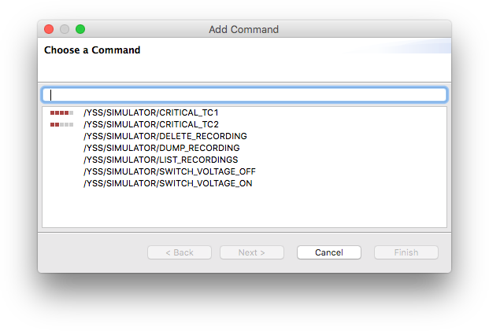
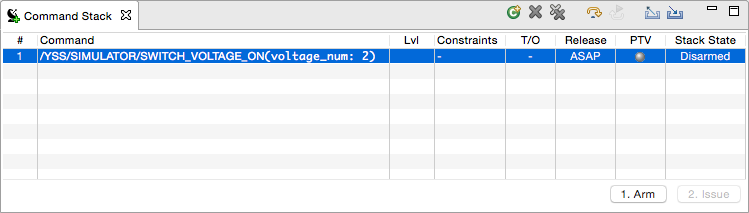
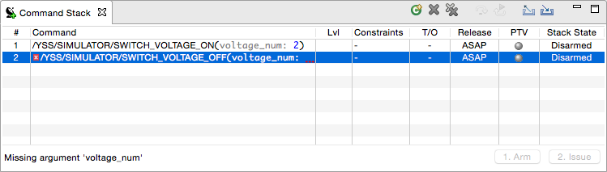

Command Stack
=============

The Command Stack allows operators to prepare stacks of commands for manual command issuing. The process is intentionally click-heavy to make sure that operators are aware of what they are doing.

When you issue commands from Yamcs Studio, these are queued to Yamcs Server, which will perform any further steps.

We're keen on bringing many improvements to this view for better editing, but it is usable in its current state.

Preparing a Stack
-----------------

You can prepare a stack of commands only when you are connected to Yamcs. Yamcs Studio uses this connection to retrieve the list of available commands or to perform server-side validations.

When you start Yamcs Studio, the Command Stack view (available from the Display Runner window) is by default shown below the operator displays. If you can't find it back, select **Window > Show View > Command Stack**.

.. image:: _images/stack-new.png
    :alt: Command Stack
    :align: center

Add a command by clicking the |new_command| **Add Command** button.

This opens a wizard dialog with the list of available commands. You can filter the list with the search box on top.

Commands are identified by their fully qualified XTCE name. This name matches the hierarchical structure of the commands as defined in the mission database of the connected Yamcs instance.

Commands can have varying levels of criticality (called *significance* in XTCE terminology). The icon in the leftmost column indicates the defined criticality for the command.

.. list-table::
    :header-rows: 1
    :widths: 25 50

    * - Icon
      - Criticality
    * - |level1|
      - Watch
    * - |level2|
      - Warning
    * - |level3|
      - Distress
    * - |level4|
      - Critical
    * - |level5|
      - Severe

If an explanatory message regarding the criticality was defined in the mission database, this will show in the top title area of the dialog when the command is selected.

Once you've chosen your command, hit **Next** to go the next page in the wizard, where you can specify any arguments that need to be provided for the command. Currently, only numbers or text can be entered.

.. note::

    You can close the wizard from the first page as well by clicking **Finish** instead of **Next**. If the command requires any arguments, you will have a chance to add them afterwards as well by editing your stacked command.

.. image:: _images/stack-add-page2.png
    :alt: Specify Command Parameters
    :align: center

Click **Finish** to append your command to the end of your current stack.

You can review your provided arguments by double clicking the command. To remove the selected command from the stack select |remove| **Delete**. Clear the entire stack with |removeall| **Delete All**.

If a stacked command does not pass static validation checks (sometimes referred to as SPTVs -- Static PreTransmission Verification) it will be marked with error indicators. This will prevent the user from attempting further execution of the stack until the error is resolved.

Executing a Stack
-----------------

As soon as your manual stack contains at least one command, you can start execution. Execution is top-down, so select the first command of your stack.

In the bottom bar click the **1. Arm** button. This will 'arm' your command, and is a first required step before issuing it. There is currently no timeout on how long a command stays armed before being reverted to disarmed. If the command you are arming has a defined criticality (watch, warning, distress, critical or severe), you will receive a confirmation dialog first.

Once your command is armed it will say so in the Stack State column.

.. note::

    *Arming* a command is a client-side notion. There is no communication with Yamcs during this step. The intention of arming a command is to make the operator aware of his actions, especially when the command is significant. There is currently no support for arming multiple commands together and execution commands in batch.

Now that your command is armed, hit **2. Issue**. There will be no more confirmation dialogs. If the server refuses your request you will receive an error message. This can happen for example when a command is only to be executed under a certain context, and within a certain time frame. These type of settings are currently exclusively defined in the Yamcs Mission Database.

To follow what happens to your command, open up the **Command History** view, explained in the next section.

When the command is issued, the Stack State column is updated, and you can arm the next command in the stack to repeat the process.

Skip the selected command by selecting |stepover_co| **Skip**. Reset the execution state by selecting |restart_co| **Restart**. This will reset all Stack State columns to **Disarmed**.

Importing and Exporting a Stack
-------------------------------

When you want to save a stack for future use, you can select |export_wiz| **Export** to save your stack in XML-format in any of your drives. Likewise, reuse a stack which you set aside by selecting |import_wiz| **Import**.

.. |export_wiz| image:: _images/export_wiz.png
.. |import_wiz| image:: _images/import_wiz.png
.. |level1| image:: _images/level1s.png
.. |level2| image:: _images/level2s.png
.. |level3| image:: _images/level3s.png
.. |level4| image:: _images/level4s.png
.. |level5| image:: _images/level5s.png
.. |new_command| image:: _images/new_command.png
.. |remove| image:: _images/remove.png
.. |removeall| image:: _images/removeall.png
.. |restart_co| image:: _images/restart_co.png
.. |stepover_co| image:: _images/stepover_co.png
