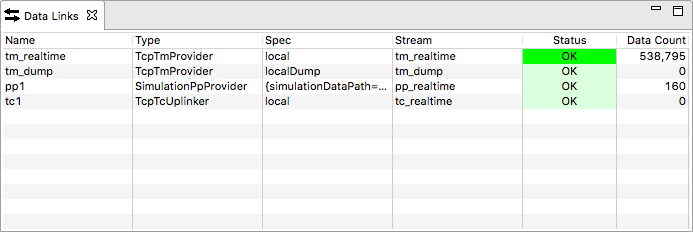

Data Links
==========

This view provides an overview of the data links of a running Yamcs server.

Data links represent input or output flows to Yamcs. There are three types of Data Links: TM (called TM Providers), TC (called TC Uplinkers) and PP (called PP Providers). TM and PP receive telemetry packets or parameters and inject them into the realtime or dump TM or PP streams. The TC data links subscribe to the realtime TC stream and send data to external systems.

The presented information includes:

Name
    Identifier of this link as assigned by Yamcs

Type
    The type of this link. For example, TcpTmProvider represents an input of TM over TCP

Spec
    Configuration information passed to the provider instance. Significance depends on the type of provider

Stream
    The internal stream where the data is either:

    * sourced from (in the case of uplinkers), or
    * published to (in the case of providers)

    It is perfectly valid for different providers or uplinkers to use the same stream.

Status
    The status of this link. One of:

    * ``OK`` if the link is alive
    * ``DISABLED`` if the link was disabled
    * ``UNAVAIL`` if the link is enabled, but not available

    The ``Status`` background lights bright green if the data count increased within the last 1500 milliseconds.

Data Count
    The number of data elements (e.g. packets) that this link published or received from its stream since Yamcs started running.

With sufficient privileges, you can enable or disable a link manually by right-clicking the applicable row and selecting **Enable Link** or **Disable Link**.
