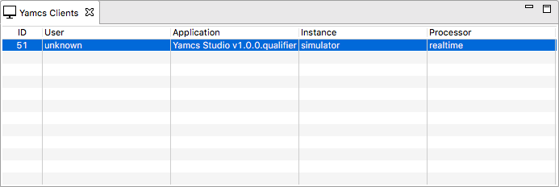

Yamcs Clients
=============

The Yamcs Clients view is a read-only view that shows you all the clients that are connected to the same Yamcs Server that you are connected to.

The displayed information includes:

ID
    The client ID assigned by Yamcs Server. Useful for debugging.

User
    The name of the connected user, or ``unknown`` if Yamcs was not secured

Application
    The name of the application that the user is using to connect to Yamcs.

Instance
    The instance this user is connected to

Processor
    The processor this user is connected to
