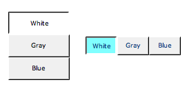

Choice Button
=============

Widget for writing one of a list of available values to a PV.

..
    ---------------------------------------------------------------------------
.. rubric:: Basic Properties

.. include:: _props/name.rst
.. include:: _props/pv_name.rst
.. include:: _props/widget_type.rst

..
    ---------------------------------------------------------------------------
.. rubric:: Behavior Properties

.. include:: _props/actions.rst
.. include:: _props/enabled.rst
.. include:: _props/items.rst
.. include:: _props/items_from_pv.rst
.. include:: _props/rules.rst
.. include:: _props/scripts.rst
.. include:: _props/visible.rst

..
    ---------------------------------------------------------------------------
.. rubric:: Border Properties

.. include:: _props/border_alarm_sensitive.rst
.. include:: _props/border_color.rst
.. include:: _props/border_style.rst
.. include:: _props/border_width.rst

..
    ---------------------------------------------------------------------------
.. rubric:: Display Properties

.. include:: _props/alarm_pulsing.rst
.. include:: _props/backcolor_alarm_sensitive.rst
.. include:: _props/background_color.rst
.. include:: _props/font.rst
.. include:: _props/forecolor_alarm_sensitive.rst
.. include:: _props/foreground_color.rst

Horizontal (``horizontal``)
    Direction in which to arrange the items.

Selected Color (``selected_color``)
    The color of the dot when selected.

.. include:: _props/tooltip.rst

..
    ---------------------------------------------------------------------------
.. rubric:: Position Properties

.. include:: _props/height.rst
.. include:: _props/scale_options.rst
.. include:: _props/width.rst
.. include:: _props/x.rst
.. include:: _props/y.rst
