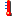
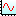

Widgets
=======

A display is a container for ordered widgets, each occupying an area
specified by x, y, width and height coordinates.

The widgets in Yamcs Studio are listed below. Note that a :doc:`display`
is itself also a kind of widget.

.. rubric:: Graphics
.. list-table::
    :widths: 33 33 33

    * - |arc| :doc:`arc`
      - |rectangle| :doc:`rectangle`
      - |label| :doc:`label`
    * - |polyline| :doc:`polyline`
      - |rounded-rectangle| :doc:`rounded-rectangle`
      - |image| :doc:`image`
    * - |polygon| :doc:`polygon`
      - |ellipse| :doc:`ellipse`
      -

.. |arc| image:: _images/icons/arc.png
.. |ellipse| image:: _images/icons/ellipse2.png

.. |label| image:: _images/icons/label.png
.. |polygon| image:: _images/icons/polygon.png
.. |polyline| image:: _images/icons/polyline.png
.. |rectangle| image:: _images/icons/rectangle2.png
.. |rounded-rectangle| image:: _images/icons/roundedRectangle.png

.. rubric:: Monitors
.. list-table::
    :widths: 33 33 33

    * - |led| :doc:`led`
      - |progress-bar| :doc:`progress-bar`
      - |xygraph| :doc:`xy-graph`
    * - |image-boolean-indicator| :doc:`image-boolean-indicator`
      - |gauge| :doc:`gauge`
      - |intensity-graph| :doc:`intensity-graph`
    * - |text-update| :doc:`text-update`
      - |thermometer| :doc:`thermometer`
      - |byte-monitor| :doc:`byte-monitor`
    * - |meter| :doc:`meter`
      - |tank| :doc:`tank`
      -

.. |byte-monitor| image:: _images/icons/ByteMonitor.png
.. |gauge| image:: _images/icons/gauge2.png
.. |image-boolean-indicator| image:: _images/icons/imageBooleanIndicator.png
.. |intensity-graph| image:: _images/icons/intensityGraph.png
.. |led| image:: _images/icons/LED.png
.. |meter| image:: _images/icons/XMeter.png

.. |tank| image:: _images/icons/tank.png
.. |text-update| image:: _images/icons/textUpdate.png

.. rubric:: Controls
.. list-table::
    :widths: 33 33 33

    * - |action-button| :doc:`action-button`
      - |knob| :doc:`knob`
      - |image-boolean-button| :doc:`image-boolean-button`
    * - |menu-button| :doc:`menu-button`
      - |scrollbar| :doc:`scrollbar`
      - |check-box| :doc:`check-box`
    * - |text-input| :doc:`text-input`
      - |thumb-wheel| :doc:`thumb-wheel`
      - |radio-box| :doc:`radio-box`
    * - |spinner| :doc:`spinner`
      - |boolean-switch| :doc:`boolean-switch`
      - |choice-button| :doc:`choice-button`
    * - |scaled-slider| :doc:`scaled-slider`
      - |boolean-button| :doc:`boolean-button`
      - |combo| :doc:`combo`

.. |boolean-switch| image:: _images/icons/BoolSwitch.png
.. |check-box| image:: _images/icons/checkboxenabledon.png
.. |choice-button| image:: _images/icons/ChoiceButton.png
.. |combo| image:: _images/icons/combo.png

.. |knob| image:: _images/icons/knob.png
.. |menu-button| image:: _images/icons/menubutton.png

.. |scaled-slider| image:: _images/icons/scaled_slider.png
.. |scrollbar| image:: _images/icons/scrollbar.png
.. |spinner| image:: _images/icons/Spinner.png
.. |text-input| image:: _images/icons/textInput.png
.. |thumb-wheel| image:: _images/icons/thumbwheel.png

.. rubric:: Others
.. list-table::
    :widths: 33 33 33

    * - |table| :doc:`table`
      - |grouping-container| :doc:`grouping-container`
      - |sash-container| :doc:`sash-container`
    * - |web-browser| :doc:`web-browser`
      - |linking-container| :doc:`linking-container`
      - |grid-layout| :doc:`grid-layout`
    * - |array| :doc:`array`
      - |tabbed-container| :doc:`tabbed-container`
      -

.. |array| image:: _images/icons/array.png
.. |grid-layout| image:: _images/icons/grid.png
.. |grouping-container| image:: _images/icons/groupContainer.png
.. |linking-container| image:: _images/icons/linkingcontainer.png
.. |sash-container| image:: _images/icons/SashContainer.png
.. |tabbed-container| image:: _images/icons/tab.png
.. |table| image:: _images/icons/table.png
.. |web-browser| image:: _images/icons/web_browser.png

Color Decorations
-----------------

When a widget is backed by a PV, it will be decorated according to its runtime state. The specific colors of these decorations can vary since the default colors can be overridden (or disabled) by the display author.

Connected
    No decorations

Connected, but no value (yet)
    Dashed pink border around the widget

Disconnected
    Solid pink border around the widget and the label 'Disconnected' in the top left corner (space-permitting)

Expired
    Blinking solid pink border around the widget

Minor Alarm
    Solid orange border around the widget

Major Alarm
    Solid red border around the widget

Yamcs parameters support five different levels of alarms, as well as a range of special monitoring values. This information is transformed using the following mapping:

* WATCH, WARNING, DISTRESS → MINOR
* CRITICAL, SEVERE → MAJOR

.. toctree::
    :maxdepth: 1
    :hidden:

    action-button
    arc
    array
    boolean-button
    boolean-switch
    byte-monitor
    check-box
    choice-button
    combo
    display
    ellipse
    gauge
    grid-layout
    grouping-container
    image
    image-boolean-button
    image-boolean-indicator
    intensity-graph
    knob
    label
    led
    linking-container
    menu-button
    meter
    polygon
    polyline
    progress-bar
    radio-box
    rectangle
    rounded-rectangle
    sash-container
    scaled-slider
    scrollbar
    spinner
    tabbed-container
    table
    tank
    text-input
    text-update
    thermometer
    thumb-wheel
    xy-graph
    web-browser
