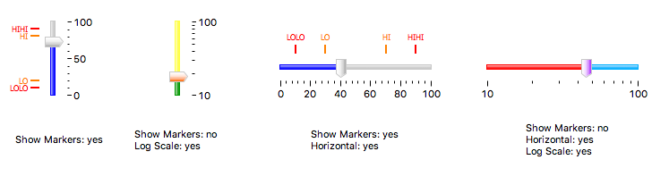

Scaled Slider
=============

Widget for reading and writing a numeric value in increments.

..
    ---------------------------------------------------------------------------
.. rubric:: Basic Properties

.. include:: _props/name.rst
.. include:: _props/pv_name.rst
.. include:: _props/widget_type.rst

..
    ---------------------------------------------------------------------------
.. rubric:: Behavior Properties

.. include:: _props/actions.rst
.. include:: _props/enabled.rst
.. include:: _props/level_hi.rst
.. include:: _props/level_hihi.rst
.. include:: _props/level_lo.rst
.. include:: _props/level_lolo.rst
.. include:: _props/limits_from_pv.rst
.. include:: _props/maximum.rst
.. include:: _props/minimum.rst

Page Increment (``page_increment``)
    Increment added/subtracted when:

    * Clicking the track next to the thumb.
    * Pressing :kbd:`PgUp` or :kbd:`PgDn`.

.. include:: _props/rules.rst
.. include:: _props/scripts.rst

Step Increment (``step_increment``)
    Increment added/subtracted when:
    
    * Dragging the slider thumb.
    * Pressing :kbd:`Left` or :kbd:`Right` (in case of a horizontal slider).
    * Pressing :kbd:`Up` or :kbd:`Down` (in case of a vertical slider).

.. include:: _props/visible.rst

..
    ---------------------------------------------------------------------------
.. rubric:: Border Properties

.. include:: _props/border_alarm_sensitive.rst
.. include:: _props/border_color.rst
.. include:: _props/border_style.rst
.. include:: _props/border_width.rst

..
    ---------------------------------------------------------------------------
.. rubric:: Display Properties

.. include:: _props/effect_3d.rst
.. include:: _props/alarm_pulsing.rst
.. include:: _props/backcolor_alarm_sensitive.rst
.. include:: _props/background_color.rst
.. include:: _props/color_fillbackground.rst
.. include:: _props/color_hi.rst
.. include:: _props/color_hihi.rst
.. include:: _props/color_lo.rst
.. include:: _props/color_lolo.rst

Fill Color (``fill_color``)
    Color of the bar up and until the current value.

.. include:: _props/font.rst
.. include:: _props/forecolor_alarm_sensitive.rst
.. include:: _props/foreground_color.rst
.. include:: _props/horizontal.rst
.. include:: _props/log_scale.rst
.. include:: _props/major_tick_step_hint.rst
.. include:: _props/scale_font.rst
.. include:: _props/scale_format.rst
.. include:: _props/show_hi.rst
.. include:: _props/show_hihi.rst
.. include:: _props/show_lo.rst
.. include:: _props/show_lolo.rst
.. include:: _props/show_markers1.rst
.. include:: _props/show_minor_ticks.rst
.. include:: _props/show_scale.rst

Thumb Color (``thumb_color``)
    Color of the thumb.

.. include:: _props/tooltip.rst
.. include:: _props/transparent_background.rst
.. include:: _props/value_label_format.rst

..
    ---------------------------------------------------------------------------
.. rubric:: Position Properties

.. include:: _props/height.rst
.. include:: _props/scale_options.rst
.. include:: _props/width.rst
.. include:: _props/x.rst
.. include:: _props/y.rst
