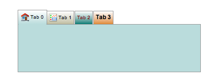

Tabbed Container
================

Container widget for grouping widgets in a number of tabs. X and Y coordinates
of contained widgets are relative to the top-left of the container.

While editing in Yamcs Studio, tabs can be organized via the right-click
context menu.

..
    ---------------------------------------------------------------------------
.. rubric:: Basic Properties

Macros (``macros``)
    Manage the macros available within this container.

.. include:: _props/name.rst
.. include:: _props/widget_type.rst

..
    ---------------------------------------------------------------------------
.. rubric:: Behavior Properties

.. include:: _props/actions.rst

Enabled (``enabled``)
    Unset to make contained control widgets unusable.

.. include:: _props/rules.rst
.. include:: _props/scripts.rst

Tab Count (``tab_count``)
    The number of tabs.

.. include:: _props/visible.rst

..
    ---------------------------------------------------------------------------
.. rubric:: Border Properties

.. include:: _props/border_color.rst
.. include:: _props/border_style.rst
.. include:: _props/border_width.rst

..
    ---------------------------------------------------------------------------
.. rubric:: Display Properties

Active Tab (``active_tab``)
    The tab that is visible.

.. include:: _props/background_color.rst
.. include:: _props/foreground_color.rst

Horizontal Tabs (``horizontal_tabs``)
    If yes, tabs are organised horizontally (at the top of the widget area).

    If no, tabs are organised vertically (at the left of the widget area).

Minimum Tab Height (``minimum_tab_height``)
    The minimum height in pixels of tabs.

.. include:: _props/tooltip.rst

Transparent (``transparent``)
    Make the container background transparent.

..
    ---------------------------------------------------------------------------
.. rubric:: Position Properties

.. include:: _props/height.rst
.. include:: _props/scale_options.rst
.. include:: _props/width.rst
.. include:: _props/x.rst
.. include:: _props/y.rst

..
    ---------------------------------------------------------------------------
.. rubric:: Tab-specific Properties

The property names for the following properties take the form ``tab_x_property_name``,
where ``x`` is the zero-based index of that tab.

Background Color (``tab_x_background_color``)
    The color of the background of the tab's bounding box.

Enabled (``tab_x_enabled``)
    Unset to make a tab unselectable, and make its contained control widgets unusable.

Font (``tab_x_font``)
    Font used for the tab title.

Foreground Color (``tab_x_foreground_color``)
    The text color used for the tab title.

Icon Path (``tab_x_icon_path``)
    Path to an image that is used as an icon next to the tab title.

Title (``tab_x_title``)
    The title of the tab.

..
    ---------------------------------------------------------------------------
.. rubric:: Additional API

Tabbed Container widgets expose the following additional API for use in scripting:

``getActiveTabIndex(): int``
    Get the index of the active tab.

``setActiveTabIndex(index: int): void``
    Activate a specific tab.
