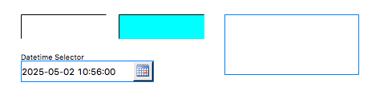

Text Input
==========

Widget for reading and writing to a PV.

..
    ---------------------------------------------------------------------------
.. rubric:: Basic Properties

.. include:: _props/name.rst
.. include:: _props/pv_name.rst

Style (``style``)
    Type of widget.

    Prefer the use of *Classic*. It leads to better
    compatibility between different OS platforms.

    .. list-table::
        :header-rows: 1
        :widths: 25 75

        * - Code
          - Value
        * - 0
          - Classic
        * - 1
          - Native

.. include:: _props/widget_type.rst

..
    ---------------------------------------------------------------------------
.. rubric:: Behavior Properties

.. include:: _props/actions.rst
.. include:: _props/confirm_message.rst
.. include:: _props/enabled.rst
.. include:: _props/limits_from_pv2.rst
.. include:: _props/maximum.rst
.. include:: _props/minimum.rst

Multi-line input (``multiline_input``)
    Allow for multiline input.

.. include:: _props/rules.rst
.. include:: _props/scripts.rst
.. include:: _props/visible.rst

..
    ---------------------------------------------------------------------------
.. rubric:: Border Properties

.. include:: _props/border_alarm_sensitive.rst
.. include:: _props/border_color.rst
.. include:: _props/border_style.rst
.. include:: _props/border_width.rst

..
    ---------------------------------------------------------------------------
.. rubric:: Display Properties

.. include:: _props/alarm_pulsing.rst
.. include:: _props/auto_size2.rst
.. include:: _props/backcolor_alarm_sensitive.rst
.. include:: _props/background_color.rst

Datetime Format (``datetime_format``)
    The format of a selected datetime. The format may include
    the following patterns: ``yyyy`` (year), ``MM`` (month),
    ``dd`` (day), ``HH`` (hour), ``mm`` (minute) and ``ss``
    (seconds).

    Examples:

    * ``yyyy-MM-dd HH:mm:ss``
    * ``MM/dd/yyyy HH:mm:ss``
    * ``MM/dd/yyyy``

    This property is only visible when **Selector Type** is set to
    ``Datetime``.

File Return Part (``file_return_part``)
    Which part of the selected path should be returned.

    This property is only visible when **Selector Type** is set to
    ``File``.

    .. list-table::
        :header-rows: 1
        :widths: 25 75

        * - Code
          - Value
        * - 0
          - Full Path
        * - 1
          - Name & Extension
        * - 2
          - Name Only
        * - 3
          - Directory

File Source (``file_source``)
    What files the selector can choose from.

    This property is only visible when **Selector Type** is set to
    ``File``.

    .. list-table::
        :header-rows: 1
        :widths: 25 75

        * - Code
          - Value
        * - 0
          - Workspace
        * - 1
          - Local File System

.. include:: _props/font.rst
.. include:: _props/forecolor_alarm_sensitive.rst
.. include:: _props/foreground_color.rst
.. include:: _props/horizontal_alignment.rst
.. include:: _props/rotation_angle.rst

Selector Type (``selector_type``)
    Use a special type of selector.

    .. list-table::
        :header-rows: 1
        :widths: 25 75

        * - Code
          - Value
        * - 0
          - None
        * - 1
          - File
        * - 2
          - Datetime

Text (``text``)
    Default text (before a PV value arrives).

.. include:: _props/tooltip.rst
.. include:: _props/transparent.rst

..
    ---------------------------------------------------------------------------
.. rubric:: Format Properties

.. include:: _props/format_type.rst
.. include:: _props/precision.rst
.. include:: _props/precision_from_pv.rst
.. include:: _props/show_units.rst

..
    ---------------------------------------------------------------------------
.. rubric:: Position Properties

.. include:: _props/height.rst
.. include:: _props/scale_options.rst
.. include:: _props/width.rst
.. include:: _props/x.rst
.. include:: _props/y.rst
