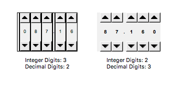

Thumb Wheel
============

Widget for reading or writing a numeric PV by digit.

..
    ---------------------------------------------------------------------------
.. rubric:: Basic Properties

.. include:: _props/name.rst
.. include:: _props/pv_name.rst
.. include:: _props/widget_type.rst

..
    ---------------------------------------------------------------------------
.. rubric:: Behavior Properties

.. include:: _props/actions.rst

Decimal Digits (``decimalDigits``)
    Number of decimal digits.

.. include:: _props/enabled.rst

Integer Digits (``integerDigits``)
    Number of integer digits.

.. include:: _props/maximum.rst
.. include:: _props/minimum.rst
.. include:: _props/rules.rst
.. include:: _props/scripts.rst
.. include:: _props/visible.rst

..
    ---------------------------------------------------------------------------
.. rubric:: Border Properties

.. include:: _props/border_alarm_sensitive.rst
.. include:: _props/border_color.rst
.. include:: _props/border_style.rst
.. include:: _props/border_width.rst

..
    ---------------------------------------------------------------------------
.. rubric:: Display Properties

.. include:: _props/alarm_pulsing.rst
.. include:: _props/backcolor_alarm_sensitive.rst
.. include:: _props/background_color.rst

Focused Frame Color (``focusedFrameColor``)
    Color of the border of the focused digit.

.. include:: _props/font.rst
.. include:: _props/forecolor_alarm_sensitive.rst
.. include:: _props/foreground_color.rst

Internal Frame Color (``internalFrameColor``)
    Color of the border surrounding each digit.

Internal Frame Thickness (``internalFrameSize``)
    Thickness in pixels of the border surrounding each digit.

Show Buttons (``show_buttons``)
    Show the arrow buttons for manipulating the digits.

.. include:: _props/tooltip.rst

..
    ---------------------------------------------------------------------------
.. rubric:: Position Properties

.. include:: _props/height.rst
.. include:: _props/scale_options.rst
.. include:: _props/width.rst
.. include:: _props/x.rst
.. include:: _props/y.rst
