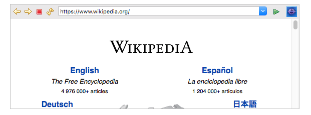

Web Browser
===========

Widget that embeds the native browser engine.

..
    ---------------------------------------------------------------------------
.. rubric:: Basic Properties

.. include:: _props/name.rst

URL (``url``)
    The website address.

.. include:: _props/widget_type.rst

..
    ---------------------------------------------------------------------------
.. rubric:: Behavior Properties

.. include:: _props/actions.rst
.. include:: _props/enabled.rst
.. include:: _props/rules.rst
.. include:: _props/scripts.rst
.. include:: _props/visible.rst

..
    ---------------------------------------------------------------------------
.. rubric:: Border Properties

.. include:: _props/border_color.rst
.. include:: _props/border_style.rst
.. include:: _props/border_width.rst

..
    ---------------------------------------------------------------------------
.. rubric:: Display Properties

..
    .. include:: _props/background_color.rst     Don't know why this is visible in studio
    .. include:: _props/foreground_color.rst     Don't know why this is visible in studio

Show Toolbar (``show_toolbar``)
    Show the browser's toolbar to allow for navigation.

.. include:: _props/tooltip.rst

..
    ---------------------------------------------------------------------------
.. rubric:: Position Properties

.. include:: _props/height.rst
.. include:: _props/scale_options.rst
.. include:: _props/width.rst
.. include:: _props/x.rst
.. include:: _props/y.rst
