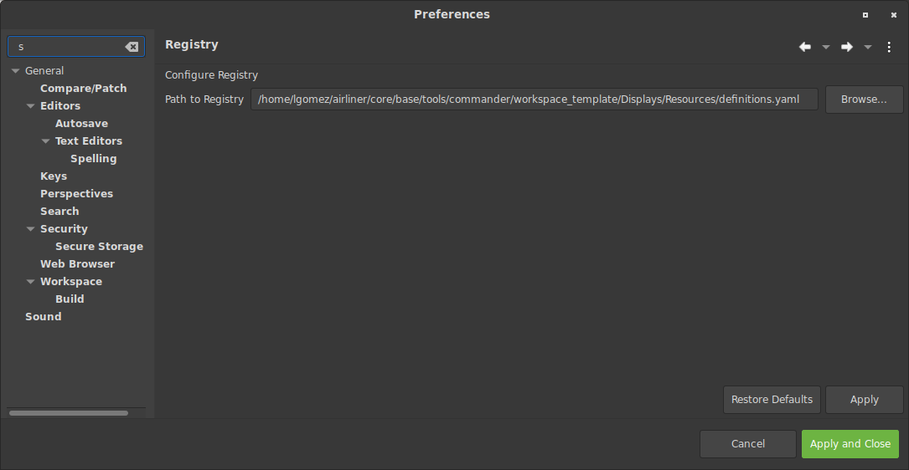

Configuration Registry
======================

The config registry is a database that holds the configuration which drives flight software. Throughout this document
`cfs <https://cfs.gsfc.nasa.gov/>`_ and `airliner <https://github.com/WindhoverLabs/airliner>`_ will be used as references, however, it should be noted
that the configuration registry can be used for any flight software that builds upon airliner. Hopefully the example and illustrations throughout this document
will make that clear.

Here is an example of a configuration registry expressed in YAML
::
  modules:
      core:
        modules:
          cfe:
            short_name: cfe
            long_name: Core Flight Executive
            config:
              CFE_SPACECRAFT_ID:
                name: CFE_SPACECRAFT_ID
                value: 66
              MESSAGE_FORMAT_IS_CCSDS:
                name: MESSAGE_FORMAT_IS_CCSDS
                value: true
              CFE_MISSION_REV:
                name: CFE_MISSION_REV
                value: 0
              CFE_CORE_MAX_STARTUP_MSEC:
                name: CFE_CORE_MAX_STARTUP_MSEC
                value: 30000
              CFE_CPU_ID:
                name: CFE_CPU_ID
                value: 1
              CFE_CPU_NAME:
                name: CFE_CPU_NAME
                value: CPU1
            modules:
              cfe_es:
                short_name: cfe_es
                long_name: Core Flight Executive - Essential Services
                app:
                  - name: CFE_ES
                events:
                  CFE_ES_INIT_INF_EID:
                    id: 1
                  CFE_ES_INITSTATS_INF_EID:
                    id: 2
                  CFE_ES_NOOP_INF_EID:
                    id: 3
                  CFE_ES_RESET_INF_EID:
                    id: 4
                  CFE_ES_SHELL_INF_EID:
                    id: 5
                type_remaps:
                  CFE_ES_MemHandle_t: uint32
                  cpuaddr: uint32
                msg_def_overrides:
                  - parent: CFE_ES_RestartCmd_Payload_t
                    member: RestartType
                    type: enumeration
                    enumerations:
                      PROCESSOR_RESET: 1
                      POWERON_RESET: 2
                telemetry:
                  CFE_ES_HK_TLM_MID:
                    msgID: 2063
                    struct: CFE_ES_HkPacket_t
                  CFE_ES_APP_TLM_MID:
                    msgID: 2071
                    struct: CFE_ES_OneAppTlm_t

                commands:
                  CFE_ES_CMD_MID:
                    msgID: 6148
                    commands:
                      Noop:
                        cc: 0
                        struct: CFE_SB_CmdHdr_t
                      Reset:
                        cc: 1
                        struct: CFE_SB_CmdHdr_t
                  CFE_ES_SEND_HK_MID:
                    msgID: 6149
                    commands:
                      SendHK:
                        cc: 0
                        struct: CFE_SB_CmdHdr_t
                perfids:
                  CFE_ES_MAIN_PERF_ID:
                    id: 1
                config:
                  CFE_ES_CDS_MAX_NAME_LENGTH:
                    name: CFE_ES_CDS_MAX_NAME_LENGTH
                    value: 16
                  CFE_ES_CRC_8:
                    name: CFE_ES_CRC_8
                    value: 1
  ...

Note that while YAML is the only format supported the registry is format-*agnostic*. Whether the format file for the registry
file is XML, YAML or SQLite the only requirement to access a registry is to follow the schema described above.

The main use in YAMCS Studio of the configuration registry is in Studio scripts:
::
  from com.windhoverlabs.studio.registry import YAMLRegistry
  registry = YAMLRegistry()
  reg_val = registry.get("/modules/core/modules/cfe/config/CFE_CORE_MAX_STARTUP_MSEC/value")
  print(reg_val)

The code above prints the value `30000`. If one follows the path passed to registry.get, one can see the value.

The file that holds the configuration registry may be configured from YAMCS Studio in **Window->Preferences->Registry**:

